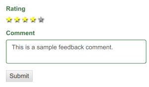
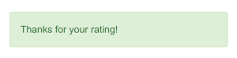

# Yii2 Simple Feedback

Rating and comment feedback system that works out of the box for Yii2.



## Installation
```php
composer require slinstj/yii2-simple-feedback
```

## The most simple way to use

*This way will use default configs*.

1 - Put the Simple Feedback Widget in your view:
```php
// in myview.php
use \slinstj\widgets\SimpleFeedback\SimpleFeedbackWidget;
?>
// put it wherever you preffer in your view:
<?= SimpleFeedbackWidget::widget() ?>
```

2 - Config the action to save the feedback data:
```php
// in SiteController
...
public function actions()
    {
        return [
            'rating' => [
                'class' => 'slinstj\widgets\SimpleFeedback\actions\RatingAction',
            ],
```

3 - Run migration to create the table where ratings will be saved:
```bash
# in your root directory, run:
php yii migrate --migrationPath=@vendor/slinstj/yii2-simple-feedback/src/migrations
```
**And it is done!**

After the user do the rate, a success or danger alert will be displayed
in substitution to the widget:


## Advanced Usage
You can change almost all default configs. These are some configs you can change:

* DB config name;
* Table and fields names;
* Labels used for rating and comment attributes;
* Rules used for the form model;
* Route that will receive the post form data;
* The target value identifying what is being rated. You can use either a string or a callback function;

### How change the default configs
Just pass the configs when calling the widget:
```php
// IMPORTANT:
// Please, refer to public attributes docblocks either in SimpleFeedbackWidget
// and SimpleFeedbackModel to see all available options.

<?= SimpleFeedbackWidget::widget([
    'formAction' => ['my-controller/my-custom-rating-action'],
    'isRatingAvailable' => true,
    'isCommentAvailable' => false,
    'modelConfigs' => [
        'dbConfigName' => 'other_db_config',
        'dbTable' => 'my_custom_table',
        ...
        // using a callback but could be just a string
        'targetValue' => function($model) {
            // do your logic to define the target value
            return \Yii::$app->params['something'];
        }
    ],
]) ?>
```

### Changing default route - full example
*Note:* Even if you change the default route, Simple Feedback will know how
redirect your user back to original route.

1 - Pass the configs to the widget:
```php
// in myview.php
use \slinstj\widgets\SimpleFeedback\SimpleFeedbackWidget;
?>
<?= SimpleFeedbackWidget::widget([
    'formAction' => ['my-controller/rating'],
]) ?>
```

2 - Config the action to save the feedback data:
```php
// MyController <<<
...
public function actions()
    {
        return [
            'rating' => [
                'class' => 'slinstj\widgets\SimpleFeedback\actions\RatingAction',
            ],
```
And it is done.

**VERY IMPORTANT**

If you have changed default configs for the model (`modelConfigs`), for example, `dbTable`, `targetValue`, etc, you **must** pass the same configs when configuring your action:
```php
// MyController
...
public function actions()
    {
        return [
            'rating' => [
                'class' => 'slinstj\widgets\SimpleFeedback\actions\RatingAction',
                'modelConfigs' => [
                    'dbTable' => 'my_custom_table',
                    'targetValue' => function($model) {
                        // do your logic to define the target value
                        return \Yii::$app->params['something'];
                    }
                ],
            ],
```


### Using special placeholder {simplefeedback}
If for any reason you need insert simple feedback inside a text you can
*also* use `begin()`, `end()` and the special placeholder to achieve it:

```php
// in your view
use \slinstj\widgets\SimpleFeedback\SimpleFeedbackWidget;
?>
...
<?php SimpleFeedbackWidget::begin([
    // configs here
]) ?>
    This text is more readable since we are using our widget
    through a special placeholder.
    Now I can keep my text clean but still have the widget.
    <hr>
    {simplefeedback}
<?php SimpleFeedbackWidget::end() ?>
```

## Next releases
- [ ] Ajax implementation;
- [ ] Handle repeated ratings;